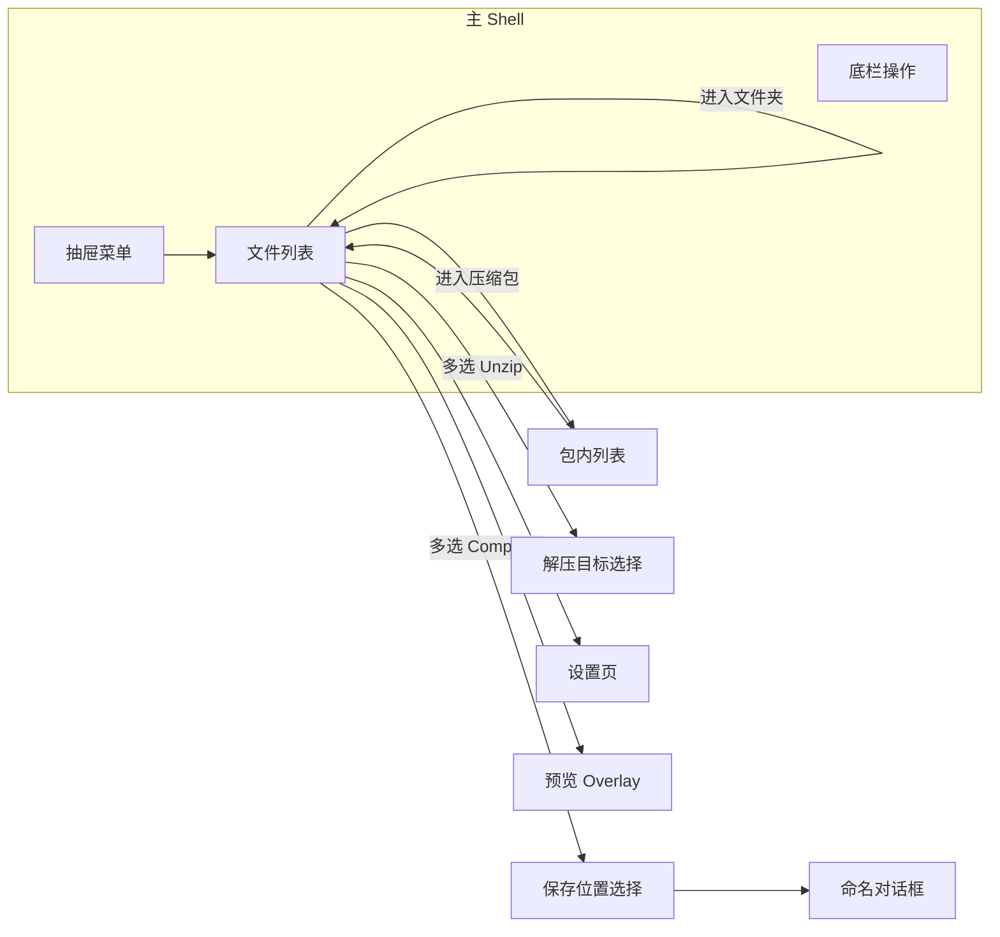

# SCZip — 界面布局设计文档

> **版本**：v1.0  
> **日期**：2026-06-20  
> **参考产品**：WinZip Mobile（Android / iOS）  
> **关联文档**：[SCZip-策划文档.md](SCZip-策划文档.md)  
> **用途**：Unity UI 实现、Prefab 拆分、交互开发的**唯一界面参考**

---

## 1. 设计目标

### 1.1 与 WinZip 的对齐关系

| 维度 | WinZip 做法 | SCZip 做法 |
|------|-------------|------------|
| 主导航 | 左侧抽屉（汉堡 + 左滑） | **完全一致** |
| 主内容区 | 文件管理器式列表 | **完全一致** |
| 多选 | 行首 Checkbox + 顶栏全选 | **完全一致** |
| 操作入口 | 选中后出现底栏按钮 + 右上角 ⋮ | **完全一致**（Compress 替代 Zip 文案） |
| 压缩包浏览 | 进入包内再列表展示 | **完全一致** |
| 设置 | 独立 Settings 页，分组列表 | **完全一致** |
| 商业化 | 底部 Banner 广告 | v1.0 可选，结构预留 |
| 品牌视觉 | WinZip 蓝 + 官方 Logo | **差异化**：SCZip 独立色与图标，不沿用商标 |

### 1.2 设计原则

1. **文件管理器优先**：用户应感觉在「高级文件管理器」中操作，而非单一压缩对话框。
2. **操作渐进披露**：未选中文件时隐藏底栏；选中 1 项与多项时按钮集不同。
3. **单场景 SPA**：全局一个 `Main` 场景，页面切换用 Panel 显隐 + 导航栈，避免多 Scene 跳转。
4. **移动优先、桌面适配**：手机竖屏为基准；平板/Windows 加宽内容区，抽屉可常驻。

---

## 2. 信息架构（IA）

### 2.1 站点地图

```
SCZip App
├── 文件浏览（核心 Shell）
│   ├── Recent
│   ├── My Files
│   ├── Storage
│   ├── Photos
│   ├── Music
│   ├── Dropbox          [v0.3]
│   └── Google Drive     [v0.3]
├── 压缩包内部浏览       （导航栈 push）
├── 文件预览             [v0.2]（全屏 overlay）
├── 创建/解压向导        （模态）
├── Clean Photo          [v1.0]（独立流程）
├── Settings
│   ├── Cloud 子配置
│   ├── Compression 子配置
│   ├── Clean Photo 子配置 [v1.0]
│   └── About
└── Pro 升级 / 广告关闭  （对话框）
```

### 2.2 导航栈

```
[Drawer 根目录] → [子文件夹...] → [压缩包内部] → [嵌套压缩包...]
        ↑_____________ Back 逐层 pop _____________|
```

- 顶栏左侧：在浏览栈深度 > 0 时，「≡」与「←」共存或「←」替代「≡」（推荐：**← 返回上一级，≡ 始终可用**）。
- 从抽屉切换根来源（如 Storage → Photos）时**清空栈**并加载新根。

### 2.3 全局页面流转



---

## 3. 布局壳层（App Shell）

所有浏览类页面共享同一壳层，仅内容区数据与底栏按钮不同。

### 3.1 竖屏手机（基准布局 360×800 dp）

```
┌──────────────────────────────────────── 360dp ────┐
│ ▌ AppBar                                         │  56dp
├──────────────────────────────────────────────────┤
│ ▌ Breadcrumb（可选，路径深时显示）                  │  40dp
├──────────────────────────────────────────────────┤
│ ▌                                                │
│ ▌                                                │
│ ▌           Content（文件列表 / 设置列表）          │  flex
│ ▌                                                │
│ ▌                                                │
├──────────────────────────────────────────────────┤
│ ▌ ActionBar（有选中项时滑入）                     │  56dp
├──────────────────────────────────────────────────┤
│ ▌ AdBanner（免费版，固定底）                      │  50dp
└──────────────────────────────────────────────────┘
     ↑
  Drawer overlay 宽 280dp，从左侧滑入
```

### 3.2 区域职责

| 区域 | 高度 | 行为 |
|------|------|------|
| **StatusBar** | 系统 | 沉浸式，AppBar 背景延伸 |
| **AppBar** | 56dp | 固定顶部，不随列表滚动 |
| **Breadcrumb** | 40dp | 路径层级 > 1 时显示；=1 时可合并进 AppBar 标题 |
| **Content** | 剩余 | 可滚动；支持下拉刷新 [可选] |
| **ActionBar** | 56dp | `selectedCount > 0` 时自底滑入（在 Ad 上方） |
| **AdBanner** | 50dp | 免费版常显；Pro 移除后 Content 延伸 |

### 3.3 平板 / 桌面（≥ 600dp 宽）

```
┌──────────┬──────────────────────────────────────┐
│ Drawer   │  AppBar                              │
│ 280dp    ├──────────────────────────────────────┤
│ 常驻     │  Breadcrumb                          │
│          ├──────────────────────────────────────┤
│          │  Content                             │
│          ├──────────────────────────────────────┤
│          │  ActionBar                           │
└──────────┴──────────────────────────────────────┘
```

- 宽度 ≥ 840dp：Content 最大宽度 720dp 居中，两侧留白。
- Windows：窗口最小 400×600；支持键鼠（单击=触摸点击，双击文件夹=进入）。

---

## 4. 组件规范

### 4.1 设计 Token

#### 颜色

| Token | 色值 | 用途 |
|-------|------|------|
| `color-primary` | `#1565C0` | AppBar、主按钮、选中态 |
| `color-primary-dark` | `#0D47A1` | 按压态 |
| `color-accent` | `#26A69A` | Compress 按钮强调 |
| `color-surface` | `#FFFFFF` | 列表背景 |
| `color-surface-dim` | `#F5F5F5` | 抽屉背景、分隔 |
| `color-text-primary` | `#212121` | 主文字 |
| `color-text-secondary` | `#757575` | 大小、日期 |
| `color-divider` | `#E0E0E0` | 行分割线 |
| `color-error` | `#D32F2F` | 删除、错误 |
| `color-success` | `#388E3C` | 完成 Toast |
| `color-cloud-online` | `#4CAF50` | 云菜单绿点 |
| `color-cloud-offline` | `#BDBDBD` | 云菜单灰点 |

#### 字体

| Token | 大小 | 字重 | 用途 |
|-------|------|------|------|
| `text-title` | 20sp | Medium | AppBar 标题 |
| `text-subtitle` | 14sp | Regular | 包内副标题、面包屑 |
| `text-body` | 16sp | Regular | 文件名 |
| `text-caption` | 12sp | Regular | 大小、日期 |
| `text-button` | 14sp | Medium | 底栏按钮、对话框按钮 |

#### 间距与圆角

| Token | 值 |
|-------|-----|
| `space-xs` | 4dp |
| `space-sm` | 8dp |
| `space-md` | 16dp |
| `space-lg` | 24dp |
| `radius-sm` | 4dp |
| `radius-md` | 8dp |
| `radius-dialog` | 12dp |
| `touch-min` | 48dp |

### 4.2 AppBar

```
┌─────────────────────────────────────────────────┐
│ [≡]  Storage › Download          [⋮]  [☑全选]   │
└─────────────────────────────────────────────────┘
  48    标题区 flex 左对齐             40   40
```

| 元素 | 规格 | 行为 |
|------|------|------|
| 菜单 `≡` | 48×48 触控区 | 打开抽屉；图标 Material `menu` |
| 标题 | 单行省略 | 显示当前导航源名或「包名 (N files)」 |
| `⋮` 溢出 | 40×40 | 无选中：New Folder、Sort、Paste；有选中：见 §7.3 |
| `☑` 全选 | 40×40 | 切换当前列表全选； indeterminate 态显示横杠 |

**压缩包内页 AppBar 示例**：

```
[≡]  archive.zip                    [⋮]  [☑]
     12 files · 45.2 MB
```

### 4.3 面包屑 Breadcrumb

```
Storage  ›  DCIM  ›  Camera
   ↑        ↑        ↑
 可点击    可点击    当前页（不可点、加粗）
```

- 水平 `ScrollView`，过长时可横向滑动。
- 分隔符 `›`，左右 padding 16dp。
- 点击某级 → pop 导航栈到该层。

### 4.4 文件列表行 FileListItem

```
┌─────────────────────────────────────────────────┐
│ ☐ │ [icon] │  filename.ext          │ 2.3 MB    │
│   │  40dp  │  副标题（可选）          │ 今天 14:30│
└─────────────────────────────────────────────────┘
  48      56         flex 1                  72dp 右对齐
```

| 状态 | 表现 |
|------|------|
| 默认 | 白底，底部分割线 |
| 按压 | `color-surface-dim` 背景 |
| 选中 | 行背景 `#E3F2FD`，Checkbox 勾选 |
| 文件夹 | 图标 `folder`；整行点击进入 |
| 压缩包 | 图标按格式；整行点击进入包内 |
| 普通文件 | 图标按 MIME；整行点击预览或打开 |

**行高**：72dp（移动端）；56dp（桌面紧凑模式可选）。

**排序默认**：文件夹优先 → 名称字母序（与 WinZip 文件管理器体验一致）。

### 4.5 底栏 ActionBar

WinZip 核心交互：**选中文件后才出现操作按钮**。

```
┌─────────────────────────────────────────────────┐
│  [Unzip]  [Compress]  [Share]  [Delete]  [More] │
└─────────────────────────────────────────────────┘
```

| 按钮 | 图标建议 | 主色/线框 |
|------|----------|-----------|
| Unzip | `unarchive` | 主色填充 |
| Compress | `archive` | Accent 填充 |
| Share | `share` | 线框 |
| Delete | `delete` | 线框，文字 error 色 |
| More | `more_horiz` | 图标按钮 |

- 按钮等分或水平滚动（项多时每按钮 min-width 72dp）。
- 未选中时 ActionBar **高度 0 / 隐藏**，列表延伸到底。
- 选中数量 > 0 时，AppBar 标题区可显示「已选 N 项」。

### 4.6 左侧抽屉 NavigationDrawer

```
┌──────────────────────── 280dp ────┐
│  ┌──── Header ──────────────────┐ │
│  │  [SCZip Logo]  SCZip         │ │  160dp
│  │  v0.1.0                      │ │
│  └──────────────────────────────┘ │
│  ─────────────────────────────── │
│  🕐  Recent                       │  48dp 行
│  📂  My Files                     │
│  💾  Storage                      │
│  🖼  Photos                       │
│  🎵  Music                        │
│  ─────────────────────────────── │  分组间隔 8dp
│  ☁   Dropbox            ●        │  ● = 登录态
│  ☁   Google Drive       ○        │
│  ─────────────────────────────── │
│  🧹  Clean Photo          [v1.0] │
│  ⚙   Settings                     │
│  ─────────────────────────────── │
│  ✕   Exit                         │
└───────────────────────────────────┘
```

| 规则 | 说明 |
|------|------|
| 当前项高亮 | 背景 `#E3F2FD`，左侧 4dp 主色条 |
| 云未登录 | 文字 `color-text-secondary`，灰点 |
| 云已登录 | 正常文字，绿点；副标题显示邮箱 [可选] |
| 遮罩 | 抽屉打开时内容区 40% 黑色半透明，点击关闭 |
| 手势 | 左边缘 20dp 内右滑打开；抽屉内左滑关闭 |

### 4.7 空状态 / 加载 / 错误

**空文件夹**：

```
        [illustration 120dp]
        此文件夹为空
        点击右上角新建文件夹
```

**加载中**：列表区居中 `CircularProgress` +「加载中…」

**错误**：全屏轻量页 + 图标 + 说明 + `[重试]` 按钮

---

## 5. 页面线框（逐屏）

### 5.1 P-01 文件浏览主页（Storage / My Files 等）

**默认态（无选中）**

```
┌─────────────────────────────────────────┐
│ [≡]  Storage                    [⋮] [☐]│
├─────────────────────────────────────────┤
│ Storage › Download                      │
├─────────────────────────────────────────┤
│ ☐  📁  Documents                        │
│ ☐  📁  Pictures                         │
│ ☐  📦  backup.zip            2.3 MB     │
│ ☐  📦  logs.tar.gz           890 KB     │
│ ☐  🖼  photo.jpg             1.1 MB     │
│                                         │
│                                         │
├─────────────────────────────────────────┤
│ ▓▓▓▓▓▓▓▓ 广告 Banner ▓▓▓▓▓▓▓▓▓▓▓▓▓▓▓   │
└─────────────────────────────────────────┘
```

**选中 1 个 zip 后（对齐 WinZip）**

```
┌─────────────────────────────────────────┐
│ [≡]  已选 1 项                  [⋮] [☑]│
├─────────────────────────────────────────┤
│ Storage › Download                      │
├─────────────────────────────────────────┤
│ ☑  📦  backup.zip            2.3 MB     │  ← 高亮行
│ ☐  📁  Documents                        │
│ ...                                     │
├─────────────────────────────────────────┤
│ [Unzip][Compress][Share][Delete][More]  │  ← 滑入
├─────────────────────────────────────────┤
│ ▓▓▓▓▓▓▓▓ 广告 Banner ▓▓▓▓▓▓▓▓▓▓▓▓▓▓▓   │
└─────────────────────────────────────────┘
```

### 5.2 P-02 Recent 最近

与 P-01 列表结构相同，数据源为最近打开的压缩包。

```
│ ☐  📦  project.zip      昨天 打开      │
│ ☐  📦  photos.zip       3天前 打开     │
```

- 无「新建文件夹」。
- 长按 → 从 Recent 移除（不移除实际文件）。

### 5.3 P-03 压缩包内部浏览

```
┌─────────────────────────────────────────┐
│ [≡]  archive.zip                [⋮] [☐]│
│      12 files · 45.2 MB · ZIP           │
├─────────────────────────────────────────┤
│ ☐  📁  src/                             │
│ ☐  📄  readme.txt            4 KB      │
│ ☐  🖼  cover.png             200 KB     │
│ ☐  📦  nested.zip             1 MB      │
├─────────────────────────────────────────┤
│ [Unzip][Compress][Share]     [More]     │
└─────────────────────────────────────────┘
```

- 副标题行：文件数、解压后大小、格式标签。
- 加密包：进入本页**之前**弹 D-01 密码框；错误则停留上级。

### 5.4 P-04 保存位置选择（Compress 流程 Step 2）

全屏 Panel 或底部 Sheet（推荐**全屏**，与 WinZip 文件夹选择一致）。

```
┌─────────────────────────────────────────┐
│ [←]  选择保存位置                        │
├─────────────────────────────────────────┤
│ My Files › Archives                     │
├─────────────────────────────────────────┤
│ 📁  2024                                │
│ 📁  2025                                │
│ ...                                     │
├─────────────────────────────────────────┤
│         [ Compress Here ]               │  主按钮固定底
└─────────────────────────────────────────┘
```

### 5.5 P-05 解压目标选择（Unzip 流程）

布局同 P-04，底按钮文案 **`[ Unzip Here ]`**。

### 5.6 P-06 Settings 设置

独立全屏 Panel（从抽屉进入），**非** Shell 底栏结构。

```
┌─────────────────────────────────────────┐
│ [←]  Settings                           │
├─────────────────────────────────────────┤
│ CLOUD SERVICES                          │  分组标题 12sp 全大写
│ ┌─────────────────────────────────────┐ │
│ │ Dropbox                    Login >  │ │
│ │ Google Drive              Logout >  │ │
│ │ Clear cloud cache                   │ │
│ └─────────────────────────────────────┘ │
│ COMPRESSION                             │
│ ┌─────────────────────────────────────┐ │
│ │ Default format              ZIP  >  │ │
│ │ Compression level        Normal  >  │ │
│ │ Encryption method       AES-128  >  │ │
│ └─────────────────────────────────────┘ │
│ GENERAL                                 │
│ ┌─────────────────────────────────────┐ │
│ │ Clear local cache                   │ │
│ └─────────────────────────────────────┘ │
│ ABOUT                                   │
│ ┌─────────────────────────────────────┐ │
│ │ Version                    0.1.0    │ │
│ │ Supported formats               >   │ │
│ │ User guide                      >   │ │
│ │ Send feedback                   >   │ │
│ └─────────────────────────────────────┘ │
└─────────────────────────────────────────┘
```

- 行高 56dp；右侧 chevron `>` 或值文本。
- 点击行 → 子页或底部选择 Sheet。

### 5.7 P-07 Clean Photo [v1.0]

```
┌─────────────────────────────────────────┐
│ [←]  Clean Photo                        │
├─────────────────────────────────────────┤
│  扫描后可释放约 1.2 GB                   │
│  [ 开始扫描 ]                            │
├─────────────────────────────────────────┤
│  ☐  截图 (128)                          │
│  ☐  重复照片 (45)                       │
│  ☐  低质量 (12)                         │
│  ☐  大图 > 5MB (23)                     │
├─────────────────────────────────────────┤
│  [ 删除所选 ]                            │
└─────────────────────────────────────────┘
```

### 5.8 P-08 文件预览 [v0.2]

全屏 Overlay，黑底或白底依类型。

```
┌─────────────────────────────────────────┐
│ [×]  readme.txt              [分享]     │
├─────────────────────────────────────────┤
│                                         │
│            （文本 / 图片 / PDF）          │
│                                         │
└─────────────────────────────────────────┘
```

图片预览：底栏 `[←] 3/12 [→]` 切换包内图片（WinZip 增强图片查看器）。

---

## 6. 对话框与浮层

### 6.1 D-01 密码输入

```
        ┌─────────────────────────┐
        │  输入密码              │
        │  archive.zip 已加密    │
        │  [••••••••••]  👁      │
        │  ☐ 本次会话记住密码     │
        │  [取消]    [确定]       │
        └─────────────────────────┘
```

- 宽 280dp，居中；错误密码行内红字「密码错误」。

### 6.2 D-02 创建压缩包命名

```
        ┌─────────────────────────┐
        │  新建压缩包            │
        │  名称                  │
        │  [ my_archive.zip   ]  │
        │  格式    [ ZIP      ▼] │
        │  级别    [ Normal   ▼] │
        │  ☐ 密码保护            │
        │  密码    [__________]  │  ← 勾选后显示
        │  [取消]    [确定]      │
        └─────────────────────────┘
```

### 6.3 D-03 删除确认

```
        ┌─────────────────────────┐
        │  删除 3 项？           │
        │  此操作无法撤销。       │
        │  [取消]  [删除]        │
        └─────────────────────────┘
```

删除按钮 `color-error` 填充。

### 6.4 D-04 进度 Overlay

```
        ┌─────────────────────────┐
        │  正在解压…             │
        │  ████████░░░░  67%     │
        │  readme.txt            │
        │  [ 取消 ]              │
        └─────────────────────────┘
```

- 阻塞式；取消后回滚未完成的单文件写入 [实现层]。

### 6.5 D-05 Pro 升级提示

```
        ┌─────────────────────────┐
        │  需要 SCZip Pro        │
        │  解压 7Z 格式需要完整版 │
        │  [ 稍后 ]  [ 升级 ]    │
        └─────────────────────────┘
```

### 6.6 M-01 长按上下文菜单（Bottom Sheet）

WinZip：长按文件弹出与底栏等价的操作列表。

```
┌─────────────────────────────────────────┐
│  backup.zip                             │
├─────────────────────────────────────────┤
│  📤  Unzip                              │
│  📦  Compress                           │
│  ✉   Mail                             │
│  📋  Copy                               │
│  ✏   Rename                             │
│  🗑  Delete                             │
│  ─────────────────                      │
│  取消                                   │
└─────────────────────────────────────────┘
```

### 6.7 M-02 溢出菜单 ⋮（无选中）

```
  New folder
  Sort by ▸ Name / Size / Date
  Paste          （剪贴板有内容时启用）
```

### 6.8 T-01 Toast

- 位置：底部 ActionBar 上方，距底 72dp。
- 时长：2s；成功绿底，错误红底。
- 文案示例：「已创建 archive.zip」「已解压 12 个文件」。

---

## 7. 交互规则（实现必读）

### 7.1 点击 vs 长按

| 手势 | 目标 | 行为 |
|------|------|------|
| 单击 | 文件夹 | 进入目录 |
| 单击 | 压缩包 | 进入包内列表（或先密码框） |
| 单击 | 普通文件 | 预览 [v0.2] 或用系统打开 |
| 单击 | Checkbox | 切换选中，不进入 |
| 长按 | 任意行 | 弹出 M-01；并选中该项 |
| 双击 | 文件夹（桌面） | 进入目录 |

### 7.2 底栏按钮显隐矩阵（对齐 WinZip）

| 上下文 | 选中 | Unzip | Compress | Share | Delete | Mail |
|--------|------|:-----:|:--------:|:-----:|:------:|:----:|
| 普通目录 | 0 | — | — | — | — | — |
| 普通目录 | 1 个压缩包 | ✅ | — | ✅ | ✅ | ✅ |
| 普通目录 | 1 个非压缩 | — | ✅ | ✅ | ✅ | ✅ |
| 普通目录 | 多个压缩包 | — | ✅ | ✅ | ✅ | ✅ |
| 普通目录 | 混合 | — | ✅ | ✅ | ✅ | ✅ |
| 包内部 | 1+ | ✅ | ✅ | ✅ | ✅ | ✅* |
| Recent | 1 个压缩包 | ✅ | — | ✅ | — | ✅ |

\* Mail 为 Pro 功能；免费版点击走 D-05。

**Rename / Copy**：仅在 **More** 或 M-01 中，且**单选**时可用。

### 7.3 溢出菜单 ⋮（有选中时）

```
  Mail
  Copy
  Rename     （仅单选）
  ─────
  Select all
  Deselect all
```

### 7.4 Compress 完整流程（界面串联）

```
文件列表 多选 → [Compress]
    → P-04 选择保存路径 → [Compress Here]
    → D-02 命名/格式/加密
    → D-04 进度
    → T-01 成功 → [打开] 可选跳转新包
```

### 7.5 Unzip 完整流程

```
选中 1 个压缩包 → [Unzip]
    → P-05 选择目标路径 → [Unzip Here]
    → D-04 进度
    → T-01 成功 → [查看文件] 跳转 My Files 或当前目录
```

---

## 8. 图标与文件类型

### 8.1 压缩包图标

| 格式 | 图标色 | 角标 |
|------|--------|------|
| ZIP | 主色 | ZIP |
| 7Z | `#FF9800` | 7Z |
| RAR | `#7B1FA2` | RAR |
| TAR.GZ | `#5D4037` | TGZ |
| GZ | `#795548` | GZ |

### 8.2 通用文件图标

沿用 MIME 映射：`image` / `video` / `audio` / `pdf` / `code` / `text` / `generic`。

资源路径规划：`Assets/_SCZip/UI/Icons/FileTypes/{type}.png`，@1x 40dp。

---

## 9. 动效规范

| 场景 | 时长 | 曲线 |
|------|------|------|
| 抽屉滑入/出 | 250ms | ease-out |
| ActionBar 显隐 | 200ms | ease-in-out |
| Panel 页面切换 | 300ms | ease-out（水平位移 30%） |
| 对话框弹出 | 200ms | scale 0.95→1 + fade |
| 列表项选中 | 100ms | 背景色过渡 |

减少动画：系统开启「减少动态效果」时改为淡入淡出。

---

## 10. Unity 实现映射

### 10.1 场景与 Prefab 树

```
Main.unity
└── Canvas (Screen Space - Camera)
    ├── SafeAreaRoot
    │   ├── AppShell
    │   │   ├── AppBar.prefab
    │   │   ├── BreadcrumbBar.prefab
    │   │   ├── FileListView.prefab      ← VirtualizedScrollList
    │   │   ├── ActionBar.prefab
    │   │   └── AdBanner.prefab
    │   ├── NavigationDrawer.prefab
    │   ├── OverlayLayer
    │   │   ├── SettingsPanel.prefab
    │   │   ├── SavePathPickerPanel.prefab
    │   │   ├── PreviewOverlay.prefab
    │   │   └── CleanPhotoPanel.prefab
    │   └── DialogLayer
    │       ├── PasswordDialog.prefab
    │       ├── CreateArchiveDialog.prefab
    │       ├── ConfirmDialog.prefab
    │       ├── ProgressDialog.prefab
    │       └── ProUpsellDialog.prefab
    └── ToastHost.prefab
```

### 10.2 ViewModel 绑定

| View | ViewModel | 主要绑定 |
|------|-----------|----------|
| FileListView | `FileBrowserViewModel` | Items, SelectedIds, IsLoading |
| ActionBar | 同上 | `AvailableActions`（计算属性） |
| AppBar | 同上 | Title, Subtitle, SelectAllState |
| NavigationDrawer | `NavigationViewModel` | MenuItems, CurrentSource |
| CreateArchiveDialog | `CompressViewModel` | Format, Level, Password |

### 10.3 UI 技术建议

| 模块 | 技术 | 理由 |
|------|------|------|
| 文件列表 | **UI Toolkit** `ListView` + 自定义 `bindItem` | 大数据虚拟化 |
| AppBar / ActionBar | UI Toolkit | 样式统一 |
| 对话框 | **UGUI** 或 UIToolkit `Dialog` | 模态与遮罩成熟 |
| 抽屉 | UI Toolkit + `translate` 动画 | 手势可接 Unity Input System |

### 10.4 屏幕 ID 一览（供代码枚举）

| ID | 名称 | Prefab |
|----|------|--------|
| `P-01` | FileBrowser | AppShell |
| `P-02` | Recent | AppShell（同 P-01，不同 VM 模式） |
| `P-03` | ArchiveInner | AppShell |
| `P-04` | SavePathPicker | SavePathPickerPanel |
| `P-05` | ExtractPathPicker | SavePathPickerPanel（复用） |
| `P-06` | Settings | SettingsPanel |
| `P-07` | CleanPhoto | CleanPhotoPanel |
| `P-08` | Preview | PreviewOverlay |

---

## 11. 交付物检查清单

实现 UI 前确认：

- [ ] AppShell 五层区域（AppBar / Breadcrumb / Content / ActionBar / Ad）已搭好
- [ ] 抽屉菜单 10 项与 WinZip 顺序一致
- [ ] 文件行 72dp、Checkbox 48dp 触控区
- [ ] 底栏显隐与 §7.2 矩阵一致
- [ ] 长按 Bottom Sheet 与底栏操作等价
- [ ] Compress / Unzip 向导全链路可通
- [ ] 密码框、进度框、删除确认已接好
- [ ] 平板/桌面 Drawer 常驻断点 600dp
- [ ] 所有文案走本地化表 `UIStrings`

---

## 12. 附录：WinZip 界面对照索引

| WinZip 界面元素 | 本文档章节 |
|-----------------|------------|
| WinZip Menu 抽屉 | §4.6、§5.1 |
| 文件列表 + Checkbox | §4.4、§5.1 |
| Unzip / Zip 底栏 | §4.5、§7.2 |
| 右上角 ⋮ Mail | §6.7、§7.3 |
| 长按上下文菜单 | §6.6 |
| 包内文件列表 | §5.3 |
| Settings | §5.6 |
| Clean Photo | §5.7 |
| 底部广告 | §3.1 |
| Zip & Email | §7.2 Mail 行 |
| 加密密码提示 | §6.1 |

---

**文档维护**：UI 变更时同步更新版本号与 §10 Prefab 树。高保真视觉稿（Figma）产出后链接至本文档头部。
