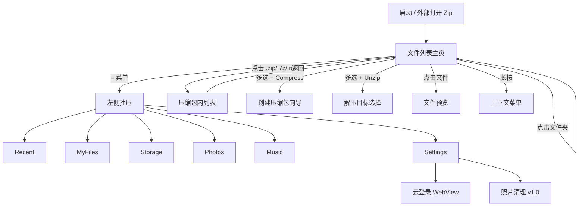

# SCZip — Unity 压缩文件管理器 策划文档

> **版本**：v1.1  
> **日期**：2026-06-20  
> **参考产品**：WinZip Mobile（Android / iOS）  
> **引擎**：Unity 2022 LTS+（建议 2022.3 或 2023.2）  
> **目标平台**：Android / iOS / Windows（Editor 调试）

---

## 1. 项目概述

### 1.1 产品定位

**SCZip** 是一款面向移动与桌面端的**压缩文件管理工具**，核心能力对标 WinZip Mobile：浏览本地与云端文件、创建/解压压缩包、加密分享、内置文件预览，以及辅助性的存储清理工具。

产品 Slogan（参考 WinZip）：

> **「世界领先的 Zip 压缩与解压工具」** — 安全压缩、快速解压、云端直连、一键分享。

### 1.2 设计原则

| 原则 | 说明 |
|------|------|
| **功能对齐** | 界面布局与交互流程高度参考 WinZip Mobile，降低用户学习成本 |
| **分阶段交付** | MVP 先落地 ZIP/TAR.GZ 等主流格式，再迭代 7Z/RAR 与更多格式 |
| **跨平台一致** | Unity UI Toolkit / UGUI 统一视觉，平台差异仅在权限与原生桥接层 |
| **可扩展架构** | 压缩引擎、存储后端、预览器均以接口抽象，便于替换实现 |

### 1.3 竞品参考来源

- [WinZip Android 用户指南](https://kb.winzip.com/130574)
- [WinZip iOS 用户指南](https://kb.corel.com/125988/)
- [WinZip iOS 功能对比（免费 vs 完整版）](https://kb.winzip.com/en/130562)
- Google Play / App Store 产品描述

---

## 2. WinZip 参考分析

### 2.1 核心功能矩阵

| 功能域 | WinZip 能力 | SCZip 优先级 |
|--------|-------------|--------------|
| 压缩格式 | ZIP、ZIPX、7Z、RAR、TAR、GZ、BZ2、XZ、ZST 等 | 见 **§3.0 多格式支持矩阵** |
| 加密 | Zip 2.0 / AES-128 / AES-256 | P0: AES-128；P1: Zip 2.0 / AES-256 |
| 文件浏览 | 本地存储、SD 卡、相册、音乐 | P0 |
| 云存储 | Dropbox、Google Drive、OneDrive、iCloud | P2 |
| 文件预览 | 图片、文本、Office、PDF、音视频 | P1 |
| 分享 | 邮件附件、复制链接、系统分享面板 | P1 |
| 照片清理 | 截图/重复/低质/大图扫描删除 | P3 |
| 商业化 | 底部广告 + 内购去广告解锁高级功能 | P3 |

### 2.2 交互模式总结

1. **左侧抽屉导航（WinZip Menu）**：汉堡按钮或左边缘右滑唤起
2. **文件列表 + 多选**：每行左侧复选框，顶部「全选」
3. **底部/顶部操作栏**：选中文件后动态显示 Zip / Unzip / Share / Delete 等
4. **长按上下文菜单**：与操作栏选项一致，附加 Cancel
5. **压缩包内浏览**：进入压缩包后列表展示内部文件，支持选择性解压/再压缩
6. **设置页**：云账号、默认压缩格式、压缩强度、加密方式、缓存清理、关于

---

## 3. 功能规格

### 3.0 多格式压缩支持规格

> 对标 WinZip Mobile + ZArchiver / PeaZip 等主流工具，覆盖用户日常遇到的**常用压缩格式**。  
> 能力分三级：**创建（Write）** / **解压（Extract）** / **浏览列表（List）**；加密与分卷单独标注。

#### 3.0.1 格式分类说明

| 类型 | 说明 | 示例 |
|------|------|------|
| **归档容器** | 将多个文件/目录打包为单一文件，可内含压缩 | ZIP, 7Z, RAR, TAR |
| **单流压缩** | 仅压缩单个文件流，不含目录结构 | GZ, BZ2, XZ, ZST |
| **组合格式** | TAR 归档 + 外层压缩算法 | tar.gz, tar.bz2, tar.xz, tar.zst |
| **派生格式** | 本质是其他格式的扩展名约定 | CBZ (=ZIP), CBR (=RAR) |

#### 3.0.2 格式支持总表

| 格式 | 扩展名 | 列表 | 解压 | 创建 | 加密 | 分卷 | 阶段 | 备注 |
|------|--------|:----:|:----:|:----:|:----:|:----:|------|------|
| **ZIP** | `.zip` | ✅ | ✅ | ✅ | AES-128/256, ZipCrypto | ✅ | **P0 / v0.1** | 默认创建格式，兼容性最佳 |
| **ZIPX** | `.zipx` | ✅ | ✅ | ✅ | 同 ZIP | ✅ | P1 / v0.3 | WinZip 扩展 ZIP，部分算法需标注兼容性 |
| **7Z** | `.7z` | ✅ | ✅ | ✅ | AES-256 | ✅ | P1 / v0.3 | 高压缩比，创建默认 LZMA2 |
| **RAR** | `.rar` | ✅ | ✅ | ❌ | ✅（解压） | ✅ | P1 / v0.3 | **仅解压**，RAR5 需 UnRAR 许可评估 |
| **RAR5** | `.rar`（v5） | ✅ | ✅ | ❌ | ✅ | ✅ | P1 / v0.3 | 与 RAR4 同一扩展名，按魔数区分 |
| **TAR** | `.tar` | ✅ | ✅ | ✅ | ❌ | ❌ | P1 / v0.2 | 仅打包不压缩，常用于 Linux 分发 |
| **GZIP** | `.gz` | — | ✅ | ✅ | ❌ | ❌ | P1 / v0.2 | 单文件；`.tar.gz` 见下行 |
| **TAR.GZ** | `.tar.gz`, `.tgz` | ✅ | ✅ | ✅ | ❌ | ❌ | **P0 / v0.1** | Linux/macOS 最常见组合格式之一 |
| **TAR.BZ2** | `.tar.bz2`, `.tbz2` | ✅ | ✅ | ✅ | ❌ | ❌ | P2 / v0.4 | 压缩比高于 gzip，速度较慢 |
| **BZIP2** | `.bz2` | — | ✅ | ✅ | ❌ | ❌ | P2 / v0.4 | 单文件流 |
| **TAR.XZ** | `.tar.xz`, `.txz` | ✅ | ✅ | ✅ | ❌ | ❌ | P2 / v0.4 | 高压缩比，适合归档 |
| **XZ** | `.xz` | — | ✅ | ✅ | ❌ | ❌ | P2 / v0.4 | 单文件流 |
| **ZSTD** | `.zst` | — | ✅ | ✅ | ❌ | ❌ | P2 / v0.4 | 现代格式，解压速度快 |
| **TAR.ZST** | `.tar.zst`, `.tzst` | ✅ | ✅ | ✅ | ❌ | ❌ | P2 / v0.4 | Linux 新发行版逐渐采用 |
| **LZ4** | `.lz4` | — | ✅ | ✅ | ❌ | ❌ | P3 / v1.0 | 极速，压缩比较低 |
| **CAB** | `.cab` | ✅ | ✅ | ❌ | ❌ | ❌ | P3 / v1.0 | Windows 安装包常见，仅解压 |
| **ISO** | `.iso` | ✅ | ✅ | ❌ | ❌ | ❌ | P3 / v1.0 | 光盘镜像，浏览/提取文件 |
| **CBZ** | `.cbz` | ✅ | ✅ | ✅ | ❌ | ❌ | P2 / v0.4 | 漫画包，按 ZIP 处理 |
| **CBR** | `.cbr` | ✅ | ✅ | ❌ | ❌ | ❌ | P2 / v0.4 | 漫画包，按 RAR 解压 |
| **LHA/LZH** | `.lzh`, `.lha` | ✅ | ✅ | ❌ | ❌ | ❌ | P3 / v1.0 | 遗留格式，WinZip iOS 支持 |
| **ARJ** | `.arj` | ✅ | ✅ | ❌ | ❌ | ✅ | P3 / v1.0 | 遗留格式，仅解压 |
| **WIM** | `.wim` | ✅ | ✅ | ❌ | ❌ | ❌ | P3 / v1.0 | Windows 镜像，可选 |

图例：**列表** = 不解压即可浏览内部目录；**—** = 单文件流无目录列表。

#### 3.0.3 分阶段交付路线（格式维度）

```
v0.1 MVP ──► ZIP, TAR.GZ（读写）+ GZ 单文件解压
    │
v0.2 ──────► TAR, GZ（创建）+ ZIP 加密全量 + CBZ
    │
v0.3 ──────► 7Z, ZIPX, RAR/RAR5（解压为主，7Z/ZIPX 可创建）
    │
v0.4 ──────► TAR.BZ2, TAR.XZ, TAR.ZST, BZ2, XZ, ZSTD, CBR
    │
v1.0 ──────► CAB, ISO, LHA, ARJ, LZ4, WIM（遗留/镜像类）
```

#### 3.0.4 默认创建格式与压缩级别

用户在 **Settings → Compression → Default Format** 选择默认输出格式：

| 预设档位 | 格式 | 算法/级别 | 适用场景 |
|----------|------|-----------|----------|
| **兼容优先**（默认） | ZIP | Deflate, Normal | 邮件、跨平台分享 |
| **体积优先** | 7Z | LZMA2, Ultra | 本地归档、大文件集合 |
| **速度优先** | ZIP 或 ZSTD | Deflate Fast / zstd:3 | 临时打包、频繁操作 |
| **Unix/Linux** | TAR.GZ | gzip:6 | 开发者、服务器产物 |
| **WinZip 对齐** | ZIPX | 最优算法组合 | 需提示接收方安装兼容工具 |

压缩级别（各格式映射为统一 UI 五档）：

| UI 档位 | ZIP | 7Z | GZIP/ZSTD |
|---------|-----|-----|-----------|
| Store（仅存储） | 无压缩 | Copy | 无压缩 |
| Fast | Deflate Fast | LZMA2 Fast | -1 ~ 1 |
| Normal | Deflate Normal | LZMA2 Normal | 6 |
| Maximum | Deflate Best | LZMA2 Ultra | 9 |
| Ultra | — | 7Z Ultra + Solid | zstd:19 |

#### 3.0.5 创建压缩包 UI 变更

在 **§4.4 创建流程** 的命名对话框中增加格式选择：

```
┌─────────────────────────────────┐
│  Archive name:                  │
│  [ my_archive              ]    │
│  Format:  [ ZIP (.zip)      ▼ ] │  ← 下拉：ZIP / 7Z / TAR.GZ / TAR / ...
│  Level:   [ Normal          ▼ ] │
│  ☐ Encrypt with password        │  （ZIP/7Z/ZIPX 可用）
│  Password: [________]           │
│  ☐ Split into volumes           │  （ZIP/7Z/RAR 创建，v0.3+）
│  Volume size: [ 100 MB      ▼ ] │
│  [Cancel]              [OK]     │
└─────────────────────────────────┘
```

- 根据所选格式**动态显隐**加密、分卷、压缩级别选项
- 列表行图标按格式区分（zip / 7z / rar / tar / gz 等）
- 不支持的格式创建时灰显并提示升级 Pro（若走付费策略）

#### 3.0.6 解压与浏览统一行为

| 行为 | 规则 |
|------|------|
| 单击压缩包 | 若支持列表 → 进入内部浏览；若仅单流（`.gz`）→ 提示解压或预览 |
| 多选解压 | 仅当选中 **1 个** 压缩包时显示 Unzip（与 WinZip 一致） |
| 嵌套压缩包 | 支持包内 `.zip` 再打开（递归深度上限 8，防 Zip Bomb） |
| 分卷包 | 自动识别 `.z01` / `.part1.rar` / `.7z.001`，提示用户选首卷或自动合并检测 |
| 密码 | ZIP / 7Z / RAR 加密包统一密码对话框，记住本次会话密码（可选，默认关） |
| 损坏包 | 校验失败显示可读错误（CRC / 格式不支持 / 需要下一分卷） |

#### 3.0.7 格式检测策略

1. **扩展名优先**：快速匹配 `ArchiveFormatRegistry`
2. **魔数校验**：打开时读取文件头验证（防改扩展名）
3. **失败降级**：扩展名与魔数不符时提示「格式可能不正确」

常见魔数：

| 格式 | 文件头（十六进制） |
|------|-------------------|
| ZIP | `50 4B 03 04` 或 `50 4B 05 06`（空包） |
| 7Z | `37 7A BC AF 27 1C` |
| RAR | `52 61 72 21 1A 07`（RAR4/5） |
| GZIP | `1F 8B` |
| BZIP2 | `42 5A 68` |
| XZ | `FD 37 7A 58 5A 00` |
| ZST | `28 B5 2F FD` |
| TAR | 偏移 257: `ustar` |

#### 3.0.8 技术实现映射

采用 **多 Provider 注册** 架构，每种格式对应 `IArchiveProvider`：

```csharp
public interface IArchiveProvider
{
    ArchiveFormat Format { get; }
    bool CanList { get; }
    bool CanExtract { get; }
    bool CanCreate { get; }
    bool SupportsEncryption { get; }
    bool SupportsVolumes { get; }

    Task<IReadOnlyList<ArchiveEntry>> ListEntriesAsync(string path, ArchiveOpenOptions options, CancellationToken ct);
    Task ExtractAsync(ExtractOptions options, IProgress<ArchiveProgress> progress, CancellationToken ct);
    Task CreateAsync(CreateArchiveOptions options, IProgress<ArchiveProgress> progress, CancellationToken ct);
}
```

| 格式组 | 实现库 | 说明 |
|--------|--------|------|
| ZIP, TAR, GZ, BZ2, XZ | **SharpZipLib** + **SharpCompress** | MVP 起纯 C#，IL2CPP 友好 |
| 7Z, ZIPX | **SharpCompress** 或 **7-Zip native** | 创建大文件建议 native |
| RAR | **UnRAR**（解压专用）或 SharpCompress | 需确认 RARLAB 许可条款 |
| ZSTD, LZ4 | **ZstdSharp** / **K4os.Compression.LZ4** | NuGet for Unity |
| ISO, CAB, WIM | **7-Zip native**（p7zip / 7z.dll） | v1.0 通过统一 Native 桥接 |
| CBZ/CBR | 委托 ZIP / RAR Provider | 扩展名映射层 |

**Native 统一桥接**（v0.3+）：Android/iOS/Windows 各打包 `lib7z.so` / `7z` 可执行文件，C# 通过 `IExternalArchiveBridge` 调用，作为 SharpCompress 能力不足时的后备。

#### 3.0.9 免费版 vs 完整版（格式权益，对齐 WinZip）

| 格式能力 | 免费版 | Pro 完整版 |
|----------|:------:|:----------:|
| ZIP 解压 / 创建 | ✅ | ✅ |
| TAR.GZ 解压 | ✅ | ✅ |
| TAR.GZ 创建 | ❌ | ✅ |
| 7Z / RAR / ZIPX 解压 | ❌ | ✅ |
| 7Z / ZIPX 创建 | ❌ | ✅ |
| TAR.XZ / ZSTD 等扩展格式 | ❌ | ✅ |
| AES 加密创建 | ❌ | ✅ |

> 实现上通过 `IFeatureGate` 拦截，UI 显示升级提示而非静默失败。

### 3.1 MVP（v0.1 — 第一阶段，约 4–6 周）

#### 3.1.1 导航与文件浏览

- [ ] 左侧抽屉菜单，包含以下入口：
  - **Recent** — 最近打开的压缩包
  - **My Files** — 应用沙盒内工作目录（解压输出、用户保存）
  - **Storage** — 设备内部存储浏览（Android SAF / iOS Document Picker 桥接）
  - **Photos** — 系统相册只读浏览（P1 可降级为 Storage 子目录）
  - **Music** — 音频文件目录浏览
  - **Settings**
  - **Exit**（桌面端为 Quit）
- [ ] 面包屑路径栏：显示当前文件夹层级，支持点击跳转
- [ ] 文件列表项：图标 + 文件名 + 大小 + 修改日期
- [ ] 文件夹双击/点击进入；压缩包单击进入内部浏览
- [ ] 多选模式：行首 Checkbox + 顶栏全选
- [ ] 空状态、加载中、错误提示

#### 3.1.2 压缩与解压

- [ ] **创建压缩包**：多选文件/文件夹 → Zip/Compress → 选择格式（默认 ZIP）→ 目标路径 → 命名 → 可选加密 → 进度
- [ ] **解压**：选中单个支持的压缩包 → Unzip → 选择目标文件夹 → 进度 → 完成
- [ ] **Compress Here**：在目标目录直接创建并命名
- [ ] **包内操作**：进入压缩包后可选部分文件 → Unzip 或再压缩为子集
- [ ] 加密包打开时弹出密码输入框
- [ ] **v0.1 格式**：ZIP、TAR.GZ（读写）；GZ 单文件（解压）；详见 §3.0.2

#### 3.1.3 文件管理

- [ ] Rename（单选）
- [ ] Delete（需确认对话框）
- [ ] Copy / Paste（剪贴板式，应用内）
- [ ] New Folder

#### 3.1.4 设置（MVP 子集）

- [ ] **Default Format**：ZIP / TAR.GZ（MVP 可选范围）
- [ ] **Compression Level**：Store / Fast / Normal / Maximum
- [ ] **Encryption Method**：AES-128（默认）/ AES-256 / Zip 2.0（加密创建 Pro 功能）
- [ ] **Clear Cache** — 本地临时解压文件清理
- [ ] **About** — 版本号、支持格式列表、用户指南、反馈入口

### 3.2 v0.2 — 预览与分享（约 3–4 周）

- [ ] 内置预览器：
  - 图片：jpg, png, gif, bmp
  - 文本：txt, log, xml, json, css, js 等
  - PDF（原生插件或 WebView）
- [ ] 压缩包内**增强图片查看器**：左右滑动浏览包内全部图片（ZIP/7Z/CBZ 等）
- [ ] 系统分享面板（Share Sheet）
- [ ] Compress & Email：压缩后调起系统邮件客户端附加附件
- [ ] 外部打开：接收「用 SCZip 打开」意图，支持 `.zip` `.7z` `.rar` `.tar.gz` 等（Android Intent / iOS Document Types）
- [ ] **v0.2 新增格式**：TAR、GZ 创建；CBZ 读写

### 3.3 v0.3 — 高压缩比格式与云存储（约 4–6 周）

- [ ] **格式（见 §3.0.2）**：7Z、ZIPX 读写；RAR/RAR5 解压；分卷包识别
- [ ] Native 7-Zip 桥接（可选，提升大文件性能）
- [ ] 云存储集成：
  - Dropbox OAuth2
  - Google Drive API
  - （可选）OneDrive
- [ ] 云文件操作：浏览、上传、下载缓存、Send Link、空间用量显示
- [ ] 云缓存管理与 Settings 内 Login/Logout

### 3.4 v0.4 — 扩展 Unix / 现代格式（约 3 周）

- [ ] **格式**：TAR.BZ2、TAR.XZ、TAR.ZST、BZ2、XZ、ZSTD 读写
- [ ] CBR 解压（RAR 引擎）
- [ ] 嵌套压缩包浏览与 Zip Bomb 防护策略落地

### 3.5 v1.0 — 完整版对齐 WinZip（约 4 周）

- [ ] Clean Photo 工具：
  - 扫描：截图、重复图、低质量、超大图
  - 阈值滑块（大图尺寸）
  - 批量选择与删除
  - 定时通知提醒（可选）
- [ ] 免费版底部 Banner 广告位 + 内购解锁（见 §3.0.9 格式权益表）：
  - 去广告
  - 云存储
  - 7Z / RAR / ZIPX 及扩展格式
  - AES 加密创建、Compress & Email
- [ ] **遗留/镜像格式**：CAB、ISO、LHA、ARJ、LZ4、WIM（解压）
- [ ] 多语言：简中、繁中、英、日、德、法、西、葡

---

## 4. 界面布局设计

> **详细线框、组件规格、交互矩阵、Unity Prefab 映射见独立文档：**  
> **[SCZip-界面布局设计.md](SCZip-界面布局设计.md)**（实现 UI 时的唯一参考）

以下为摘要，完整内容以上述文档为准。

### 4.1 全局布局结构（摘要）

```
┌─────────────────────────────────────────────┐
│ [≡]  当前路径 / 标题              [⋮] [☑]  │  ← 顶栏 AppBar
├─────────────────────────────────────────────┤
│                                             │
│   ☐  📁 Documents                           │
│   ☐  📁 Downloads                           │
│   ☐  📦 archive.zip          2.3 MB  今天   │  ← 文件列表（图标按格式区分）
│   ☐  📦 backup.7z            1.8 MB  昨天   │
│   ☐  📦 source.tar.gz        5.2 MB  3天前   │
│   ☐  🖼 photo.jpg            1.1 MB  昨天   │
│   ☐  📄 readme.txt           4 KB   3天前   │
│                                             │
├─────────────────────────────────────────────┤
│  [Unzip]  [Compress]  [Share]  [Delete]  [More]  │  ← 选中后底栏（Compress 替代原 Zip）
├─────────────────────────────────────────────┤
│          ▓▓▓ 广告 Banner（免费版）▓▓▓        │  ← v1.0 可选
└─────────────────────────────────────────────┘
```

### 4.2 左侧抽屉菜单（WinZip Menu）

```
┌──────────────────┐
│  SCZip           │
│  ─────────────── │
│  🕐 Recent       │
│  📂 My Files     │
│  💾 Storage      │
│  🖼 Photos       │
│  🎵 Music        │
│  ─────────────── │
│  ☁ Dropbox      │  ← v0.3，未登录显示灰色
│  ☁ Google Drive  │
│  ─────────────── │
│  🧹 Clean Photo  │  ← v1.0
│  ⚙ Settings      │
│  ✕ Exit          │
└──────────────────┘
```

**交互**：
- 点击菜单项 → 关闭抽屉 → 加载对应根目录
- 云服务项目显示登录状态圆点（绿/灰）
- 支持左边缘滑动手势打开（移动端）

### 4.3 压缩包内部浏览页

与文件夹列表布局相同，额外元素：

- 顶栏副标题：`archive.7z (12 files, 45.2 MB)` 或 `backup.tar.gz`
- 加密包：进入前密码对话框
- 操作栏默认：**Unzip** + **Compress**（子集）+ **Share** + **⋮ More**

### 4.4 创建压缩包流程（模态/全屏向导）

```
Step 1: 选择文件（已在列表多选完成）
    ↓ 点击 [Compress]
Step 2: 选择保存位置（文件夹树 + 面包屑）
    ↓ 点击 [Compress Here]
Step 3: 命名与格式对话框（见 §3.0.5）
    ┌─────────────────────────┐
    │  Archive name:          │
    │  [ my_archive.zip    ]  │
    │  Format: [ ZIP ▼ ]      │
    │  Level:  [ Normal ▼ ]    │
    │  ☐ Encrypt with password│
    │  [Cancel]        [OK]   │
    └─────────────────────────┘
    ↓
Step 4: 进度 overlay — 「Compressing...」+ 进度条 + 取消
    ↓
Step 5: Toast「Archive created」+ 可选「Open」
```

### 4.5 设置页布局

```
Settings
├── Cloud Services
│   ├── Dropbox          [Login / Logout]  已用 2.1/15 GB
│   ├── Google Drive     [Login / Logout]
│   └── Clear cloud cache
├── Compression
│   ├── Default Format     [ZIP ▼]     ZIP / 7Z / TAR.GZ / ...
│   ├── Compression Level  [Normal ▼]   Store / Fast / Normal / Max
│   ├── Zip Strength       ( ) Legacy  (•) Best Method   ← ZIPX 专用
│   └── Encryption         [AES-128 ▼]
├── Clean Photo          → 子页（v1.0）
│   ├── Screenshots  [开关]
│   ├── Duplicates   [开关]
│   ├── Low quality  [开关]
│   ├── Large photos [开关] + 尺寸滑块
│   └── Notifications
├── General
│   └── Clear local cache
└── About
    ├── Version 0.1.0
    ├── User Guide
    └── Send Feedback
```

### 4.6 视觉规范（摘要）

详见 [界面布局设计 §4.1 设计 Token](SCZip-界面布局设计.md#41-设计-token)。

### 4.7 页面流转图（摘要）

完整流转与 8 个页面线框见 [界面布局设计 §2、§5](SCZip-界面布局设计.md)。



---

## 5. 技术架构（Unity）

### 5.1 目录结构（规划）

```
SCZip/
├── Assets/
│   ├── _SCZip/
│   │   ├── Scenes/
│   │   │   ├── Bootstrap.unity      # 初始化、服务注入
│   │   │   └── Main.unity           # 单场景 SPA 式 UI
│   │   ├── Scripts/
│   │   │   ├── Core/                # 入口、DI、事件总线
│   │   │   ├── Domain/              # 实体：FileEntry, ArchiveEntry
│   │   │   ├── Services/
│   │   │   │   ├── IFileSystemService.cs
│   │   │   │   ├── IArchiveService.cs          # 门面，路由到 Provider
│   │   │   │   ├── IArchiveProvider.cs         # 单格式实现
│   │   │   │   ├── ArchiveFormatRegistry.cs    # 扩展名 + 魔数注册表
│   │   │   │   ├── IFeatureGate.cs             # 免费/Pro 格式权益
│   │   │   │   ├── ICloudStorageService.cs
│   │   │   │   ├── IPreviewService.cs
│   │   │   │   └── ISettingsService.cs
│   │   │   ├── Infrastructure/
│   │   │   │   ├── Providers/                  # ZipProvider, SevenZipProvider, RarProvider...
│   │   │   │   ├── Native/                     # lib7z 桥接
│   │   │   │   └── SharpZipLib / SharpCompress
│   │   │   ├── UI/
│   │   │   │   ├── Views/           # 各面板 MonoBehaviour
│   │   │   │   ├── ViewModels/      # MVVM 绑定
│   │   │   │   └── Widgets/         # 文件行、面包屑、进度条
│   │   │   └── Platform/            # Android/iOS/Windows 桥接
│   │   ├── UI/
│   │   │   ├── UXML/USS 或 Prefabs   # UI Toolkit 或 UGUI
│   │   │   ├── Icons/
│   │   │   └── Fonts/
│   │   └── Resources/
│   ├── Plugins/
│   │   ├── Android/
│   │   └── iOS/
│   └── StreamingAssets/
├── docs/
│   └── SCZip-策划文档.md
├── Packages/
└── ProjectSettings/
```

### 5.2 架构模式

**MVVM + 服务层**，UI 不直接操作文件系统。

```
┌─────────────┐     ┌──────────────┐     ┌─────────────────┐
│   View      │ ←→  │  ViewModel   │ ←→  │    Services     │
│ (UGUI/UITK) │     │              │     │ File/Archive/...│
└─────────────┘     └──────────────┘     └────────┬────────┘
                                                  │
                                         ┌────────▼────────┐
                                         │ ArchiveProviders│
                                         │ ZIP/TAR/GZ/7Z/..│
                                         │ SharpCompress   │
                                         │ Native 7-Zip    │
                                         └─────────────────┘
```

### 5.3 核心接口草案

```csharp
// 文件系统抽象
public interface IFileSystemService
{
    Task<IReadOnlyList<FileEntry>> ListDirectoryAsync(string path);
    Task CopyAsync(string src, string dest);
    Task MoveAsync(string src, string dest);
    Task DeleteAsync(string path);
    Task CreateDirectoryAsync(string path);
}

// 压缩服务门面 — 按路径自动选择 Provider
public interface IArchiveService
{
    ArchiveFormat DetectFormat(string path);
    IArchiveProvider GetProvider(ArchiveFormat format);
    Task CreateAsync(CreateArchiveOptions options, IProgress<ArchiveProgress> progress, CancellationToken ct);
    Task ExtractAsync(ExtractOptions options, IProgress<ArchiveProgress> progress, CancellationToken ct);
    Task<IReadOnlyList<ArchiveEntry>> ListEntriesAsync(string path, ArchiveOpenOptions options, CancellationToken ct);
    bool IsSupportedArchive(string path);
    IReadOnlyList<ArchiveFormat> GetCreatableFormats();   // 受 FeatureGate 过滤
    IReadOnlyList<ArchiveFormat> GetExtractableFormats();
}

public enum ArchiveFormat
{
    Zip, Zipx, SevenZip, Rar, Tar, Gzip, TarGzip, TarBzip2, TarXz, TarZstd,
    Bzip2, Xz, Zstd, Lz4, Cab, Iso, Cbz, Cbr, Lha, Arj, Wim
}
```

### 5.4 压缩库选型（多格式）

| 库 | 覆盖格式 | 优点 | 缺点 | 阶段 |
|----|----------|------|------|------|
| **SharpZipLib** | ZIP, TAR, GZIP, BZIP2 | 纯 C#、成熟、AES Zip | 无 7Z/RAR | v0.1 起 |
| **SharpCompress** | ZIP, 7Z, RAR, TAR.*, XZ, GZ... | 格式广、纯 C# | RAR 只读；IL2CPP 需 link.xml | v0.2 起 |
| **7-Zip Native** | 7Z, ZIPX, CAB, ISO, WIM, ARJ... | 格式最全、性能好 | 各平台打包 native 库 | v0.3 起 |
| **UnRAR.dll / libunrar** | RAR/RAR5 解压 | 官方兼容性好 | 许可限制，**不可创建 RAR** | v0.3 |
| **ZstdSharp** | ZST, TAR.ZST | 速度快 | 需单独集成 | v0.4 |
| **K4os.Compression.LZ4** | LZ4 | 极速 | 压缩比低 | v1.0 |

**推荐组合**：SharpZipLib（ZIP 主力）+ SharpCompress（7Z/TAR 族）+ Native 7-Zip（后备与镜像类）。

### 5.5 UI 技术选型

| 方案 | 适用场景 |
|------|----------|
| **Unity UI Toolkit** | 列表密集、样式复用、响应式布局 — **推荐主界面** |
| **UGUI** | 复杂弹窗、进度条、与现有资源兼容 |
| **混合** | UIToolkit 列表 + UGUI 模态框（常见做法） |

### 5.6 平台桥接要点

| 平台 | 能力 | 实现方式 |
|------|------|----------|
| Android | SAF 存储访问、Intent 打开 | `AndroidJavaObject` + 自定义 AAR |
| iOS | Document Picker、Share Extension | Native Plugin + Xcode 工程配置 |
| Windows | 任意路径读写 | `System.IO` 直接使用 |
| 通用 | 系统分享 | `NativeShare` 插件或自研 |

### 5.7 性能与体验

- 大目录**虚拟化列表**（只渲染可见行，RecycleView 模式）
- 压缩/解压**后台线程** + 主线程更新 UI（`Task` + `UnityMainThreadDispatcher`）
- 大于 100MB 的 Zip 分块处理，支持取消
- 最近文件、目录缓存用 SQLite 或 JSON 持久化

### 5.8 安全

- 密码仅内存驻留，不写日志
- 加密 Zip 使用 AES-128/256，密钥派生 PBKDF2
- 云 OAuth Token 存平台 Keychain/Keystore
- 临时解压目录定期清理

---

## 6. 数据模型

### 6.1 FileEntry

| 字段 | 类型 | 说明 |
|------|------|------|
| Id | string | 唯一标识（路径哈希） |
| Name | string | 显示名 |
| FullPath | string | 绝对或虚拟路径 |
| IsDirectory | bool | 是否文件夹 |
| IsArchive | bool | 是否压缩包 |
| ArchiveFormat | enum? | Zip / SevenZip / Rar / TarGzip / ... |
| SizeBytes | long | 字节 |
| ModifiedUtc | DateTime | 修改时间 |
| Source | enum | Local / MyFiles / CloudDropbox / ... |

### 6.2 RecentItem

| 字段 | 说明 |
|------|------|
| ArchivePath | 最近打开的压缩包路径 |
| Format | 格式枚举（用于列表图标） |
| LastOpenedUtc | 打开时间 |
| ThumbnailPath | 可选缩略图 |

### 6.3 UserSettings（PlayerPrefs / JSON）

```json
{
  "defaultFormat": "Zip",
  "compressionLevel": "Normal",
  "zipStrength": "Legacy",
  "encryptionMethod": "Aes128",
  "cloudCacheMaxMb": 500,
  "cleanPhoto": {
    "screenshots": true,
    "duplicates": true,
    "lowQuality": false,
    "largePhotos": true,
    "largePhotoThresholdMb": 5
  },
  "locale": "zh-CN"
}
```

---

## 7. 开发里程碑

| 阶段 | 周期 | 交付物 | 验收标准 |
|------|------|--------|----------|
| **M0 工程搭建** | 1 周 | Unity 工程、空场景、CI、目录规范 | 可编译运行空白 App |
| **M1 MVP 浏览** | 2 周 | 抽屉菜单、本地列表、面包屑、多选 | 可浏览 My Files / Storage |
| **M2 MVP 压缩** | 2 周 | ZIP + TAR.GZ 创建/解压、加密、进度 | 多格式基础流程可用 |
| **M3 文件操作** | 1 周 | 重命名、删除、复制、新建文件夹 | 与 WinZip 基础操作一致 |
| **M4 预览分享** | 3 周 | 预览、系统分享、多格式外部打开 | v0.2 发布候选 |
| **M5 主流格式** | 3 周 | TAR/GZ/CBZ + 7Z/ZIPX/RAR 解压 | v0.3 |
| **M6 扩展格式** | 3 周 | TAR.XZ/ZSTD 等 + Native 7z | v0.4 |
| **M7 云存储** | 3 周 | Dropbox/GDrive | 云模块独立交付 |
| **M8 商业化** | 4 周 | 广告、内购、遗留格式、多语言 | v1.0 |

---

## 8. 测试计划

### 8.1 功能测试用例（节选）

| ID | 场景 | 步骤 | 期望 |
|----|------|------|------|
| TC-01 | 创建 ZIP | 多选 3 文件 → Compress → ZIP → 保存 | 生成可打开 zip |
| TC-02 | 创建 TAR.GZ | 多选文件夹 → Compress → TAR.GZ | 解压后目录结构正确 |
| TC-03 | 解压 7Z | 打开 sample.7z → Unzip | 文件完整 |
| TC-04 | 解压 RAR | 打开 sample.rar | 列表正确，不可创建 RAR |
| TC-05 | 加密 ZIP | AES-256 创建 → 输入密码打开 | 列表展示内部文件 |
| TC-06 | 错误密码 | 加密包输入错误密码 | 提示错误，不崩溃 |
| TC-07 | 部分解压 | 包内选 2/5 → Unzip | 目标目录仅 2 文件 |
| TC-08 | 多选限制 | 选 2 个压缩包 | 无 Unzip，有 Compress |
| TC-09 | 分卷 RAR | 打开 part1.rar | 自动识别或提示选首卷 |
| TC-10 | 魔数校验 | 将 .txt 改名为 .zip | 提示格式不正确 |
| TC-11 | CBZ | 打开 comics.cbz | 按 ZIP 浏览图片 |
| TC-12 | 嵌套包 | zip 内含 zip | 可进入第二层（深度限制内） |
| TC-13 | 外部打开 | Intent 打开 .tar.gz | 进入浏览或解压流程 |
| TC-14 | Pro 门控 | 免费版创建 7Z | 显示升级提示 |

### 8.2 兼容性

- Android 8.0 – 14.0
- iOS 13 – 18
- 测试文件：各格式标准样本（见 `Tests/Fixtures/Archives/`）、中文文件名、分卷包、损坏包、4GB+ 大文件（可选）

### 8.3 性能基线

| 指标 | 目标 |
|------|------|
| 冷启动 | < 2s（中端机） |
| 1000 项目录列表 | 滚动 60fps（虚拟列表） |
| 100MB 7Z 解压 | UI 不卡死，可取消 |
| 格式探测 | 20 种扩展名注册表查询 < 1ms |

---

## 9. 风险与对策

| 风险 | 影响 | 对策 |
|------|------|------|
| Android 分区存储限制 | 无法随意读写 SD 卡 | 尽早接入 SAF，抽象路径层 |
| RAR 格式专利/许可 | 法律风险 | **仅解压**，使用 UnRAR 许可版本，UI 不提供创建 RAR |
| RAR5 / 加密 RAR | 兼容性 | 单独测试矩阵；失败时提示用 PC 端工具 |
| 多库并存体积 | APK/IPA 增大 | 按需动态下载 Native 插件或 Pro 模块 |
| Zip Bomb / 嵌套攻击 | 设备卡死 | 深度限制 8、解压比阈值、总输出上限 |
| IL2CPP + SharpCompress | AOT 裁剪异常 | link.xml 保留程序集 |
| 云 API 审核与配额 | 上线延迟 | MVP 不依赖云，独立模块 |
| UI 与 WinZip 过于相似 | 商标/UI 纠纷 | 独立品牌色、图标、名称 SCZip |

---

## 10. 后续文档清单

| 文档 | 说明 | 状态 |
|------|------|------|
| SCZip-策划文档.md | 本文档（含 §3.0 多格式规格） | ✅ v1.1 |
| SCZip-界面布局设计.md | WinZip 对齐线框、组件、交互、Prefab 映射 | ✅ v1.0 |
| SCZip-格式支持矩阵.xlsx | 完整格式 × 平台 × 版本交叉表 | 待产出 |
| SCZip-UI线框图.fig / .png | Figma 高保真视觉稿（可选，补充文档） | 待产出 |
| SCZip-技术设计.md | 接口、类图、序列图 | 待产出 |
| SCZip-API云存储.md | OAuth 与 REST 封装 | v0.3 |
| SCZip-测试用例.xlsx | 完整测试矩阵 | M1 起 |

---

## 11. 附录：WinZip 操作栏逻辑速查

> 实现文件选择后按钮显隐的核心规则（来自官方文档）

| 上下文 | 选中内容 | 可用操作 |
|--------|----------|----------|
| 普通文件夹 | 1 个压缩包 | Unzip, Mail, Delete, Copy, Rename |
| 普通文件夹 | 2+ 个压缩包 | Compress, Mail, Delete, Copy（无 Unzip/Rename） |
| 普通文件夹 | 混合文件 | Compress, Delete, Copy, ... |
| 压缩包内部 | 1+ 文件 | Unzip, Compress, Share, Mail（付费） |
| 云存储 | 单文件 | Compress/Unzip, Send Link, Delete, Copy, Rename |
| 不支持创建的格式 | 选中 RAR | 无 Compress，仅 Unzip（单选时） |

---

**文档维护**：随迭代更新版本号与里程碑状态。下一步建议产出 **UI 线框图** 并 **初始化 Unity 工程（M0）**。
